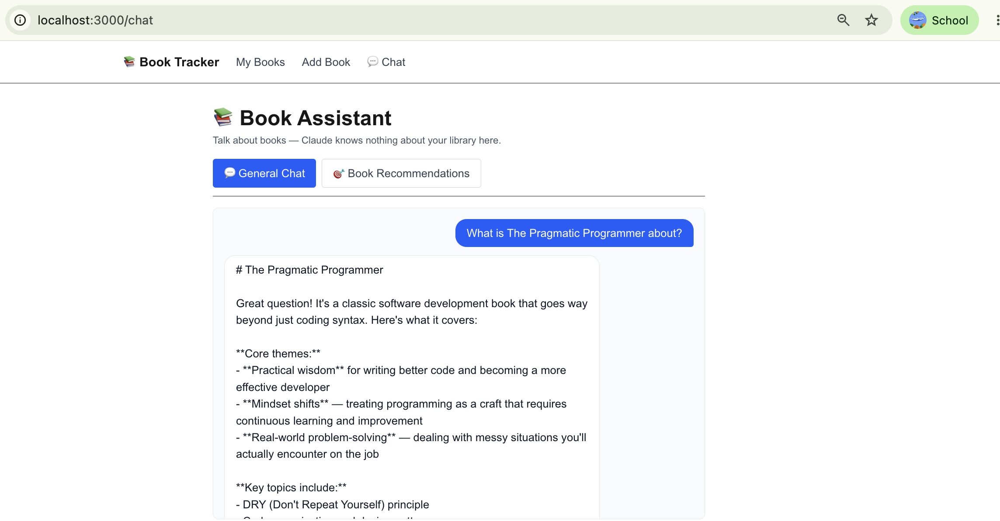
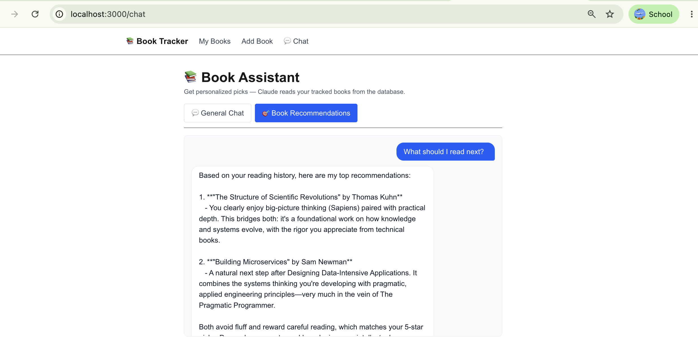

# Week 5 — AI Book Assistant

**Mingjing Zhang** · CSE552 · 2026-05-31

## Repos

- **Backend**: <https://github.com/mingjing-zhang/week-05-api>
- **Frontend**: <https://github.com/mingjing-zhang/week-05-frontend>

Both public. API key in `.env`, gitignored.

## What's in the chat page

Two modes, toggled at the top:

- **General Chat** → `POST /ai/chat` (no DB read)
- **Book Recommendations** → `POST /ai/recommend` (reads the `Book` table, injects titles into the system prompt)

Right-blue user bubbles, left-white assistant bubbles, conversation history kept in component state and sent on every turn, "Thinking…" indicator, auto-scroll, history clears on mode switch.

### Screenshot 1 — General Chat

A book question with no DB grounding.

### Screenshot 2 — Personalized Recommendation

Recommendation that **explicitly references the user's tracked books** (`Sapiens`, `Designing Data-Intensive Applications`), proving the DB → system-prompt grounding works end to end.

## Reflection

### Q1. System prompt vs user message — why separate?

The system prompt is developer code; the user message is untrusted input. Mixing them invites prompt injection — the model has no other way to tell which is which. The Anthropic API enforces the separation by giving them different `role` slots. Same shape as SQL parameterization: keep program separate from data.

This is exactly what lets `/ai/recommend` inject the user's book list into the system prompt without ever putting it in the user turn — so the user can't tamper with it from the chat input.

### Q2. What happened when you swapped system prompts in Part 4?

Four variants, same user question ("Recommend a book about systems thinking"). Full transcripts in `PROMPT_EXPERIMENTS.md`. Headlines:

- **Baseline**: 201 output tokens, friendly multi-recommendation with a follow-up question.
- **"Marcus" persona** ("opinionated lit professor"): **284 tokens, +41%**. Personas grant permission to editorialize. Cost matters.
- **Strict format constraint** ("3 entries, this template, no preamble"): **165 tokens, the shortest**. Constraints compress output.
- **Topic guardrail** ("ONLY books"): looked identical to baseline on book questions. On *"What's the weather like?"* it cleanly redirected back to books.

The surprise was the guardrail — completely invisible until violated. That's the right shape: silent in the common case, decisive at the edge.

### Q3. Where could AI in this app cause harm, and how would you mitigate it?

A confidently-hallucinated book title taken as a purchase decision — money spent on something that doesn't exist. Same shape applies to *"is this book appropriate for my 8-year-old?"*: a fabricated content summary in a parenting context.

Mitigations, in layers:

1. **Ground in real data** (the DB for tracked books; Google Books / OpenLibrary for the rest) rather than model recall.
2. **No irreversible actions.** The model proposes, the user commits. No auto-purchase, no auto-share.
3. **UI transparency.** "AI-generated — verify before action" affordance, link out to a real catalog.
4. **Validate response shape** on the backend for structured outputs, reject hallucinated fields.

The higher the stakes downstream, the more verification belongs between the model and the action.

### Q4. If you had infinite credits, what AI feature would you add?

A **"Discuss this book" mode** that grounds the AI in the book's actual text via RAG.

Concretely: a `book_chunks` table with `pgvector` embeddings; a `POST /books/{id}/ingest_text` endpoint that chunks and embeds full text (Project Gutenberg, partial-content APIs, or user upload); and a `POST /ai/discuss` endpoint that retrieves the top-k passages on each user turn and stuffs them into the system prompt with chunk-index citations. The frontend renders citations as clickable jumps to the source paragraph.

Every other AI feature I might add — summaries, themes, character maps — becomes a downstream query against a grounded source instead of trusting model recall. It also directly closes the Q3 harm: a passage-grounded answer is auditable; a hallucinated summary is not.

There's a personal angle. My day work is Bitcoin protocol research. The same RAG pattern over BIPs and papers would let me ask *"where exactly did Wuille say that about SIGHASH?"* and get a citable passage. The book tracker is just a friendlier surface for the same pattern.

## Notes

- Model: `claude-haiku-4-5` instead of the lab's `claude-sonnet-4-6`. ~3× cheaper, indistinguishable quality on this workload.
- Total Anthropic spend across endpoint smoke tests, the four Part-4 experiments, and live browser testing: **~$0.013**.
- `PROMPT_EXPERIMENTS.md` has full transcripts of all four variants plus the off-topic guardrail test.
